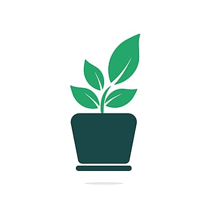
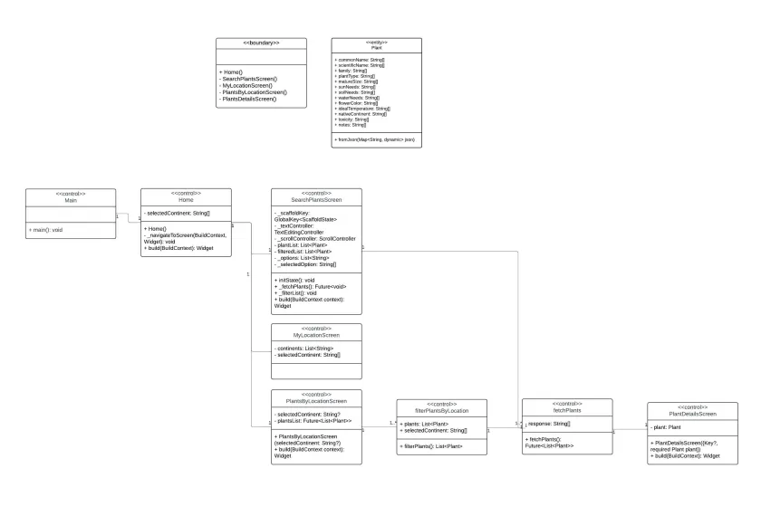
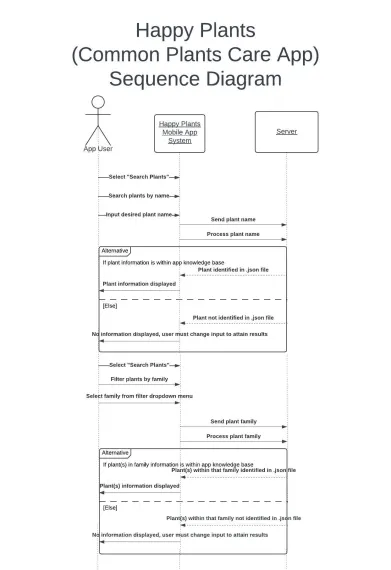
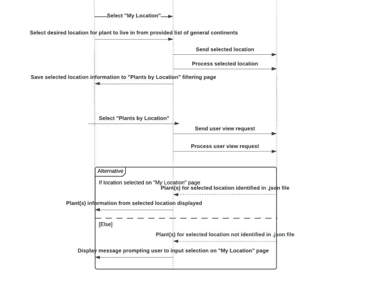
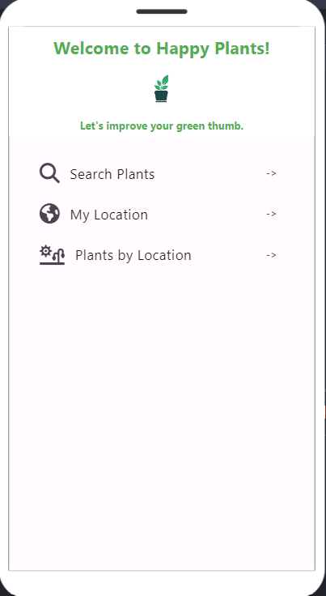
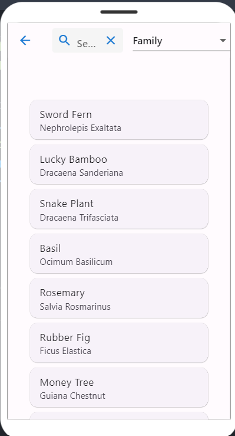
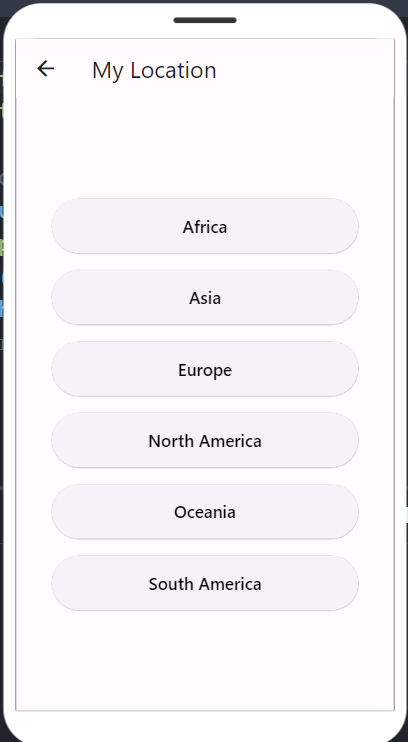
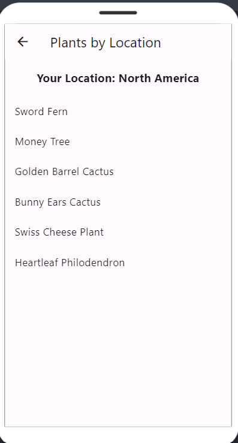

<!-- Title Page -->

# Happy Plants

## A Comprehensive Resource for Maintaining Healthy Plants

**Authors: Taylor Fettig, Alex Tillery, Hailey Siwek**

**Date: 5/31/2024**

**Course: CIS 350**

**Institution: Grand Valley State University**

# 1 Abstract

Happy Plants is an innovative application developed to assist plant enthusiasts in maintaining healthy plants. The app offers a user-friendly interface that allows users to search for a variety of common household plants and access detailed care information. Key features include a comprehensive plant database, specific care instructions, and a selection of plants based on general location. The development of Happy Plants involved extensive research into plant care requirements and intuitive user experience design. By providing easy access to reliable plant care information, Happy Plants aims to empower users to create thriving gardens, ultimately enhancing their living spaces and promoting well-being.

---

# 2 Introduction

Happy Plants is a user-friendly application that revolutionizes the way plant enthusiasts manage their indoor greenery. The app allows users to effortlessly search for a wide variety of common household plants, making it easy to find detailed information about their favorite plants. With a comprehensive database at their fingertips, users can select specific plants and access a wealth of knowledge on how to care for them, including watering schedules, sunlight requirements, and tips for maintaining optimal health. Whether you are a seasoned plant parent or a beginner looking to cultivate your green thumb, Happy Plants provides all the necessary tools and information to ensure your plants thrive. By centralizing plant care information and offering plant-specific advice, Happy Plants empowers users to create a nurturing environment for their plants, ultimately leading to happier and healthier homes.

---

# 3 Architectural Design

The Happy Plants app is based on a simple frontend and database architecture, with the database being a .json file. The app caters to plant enthusiasts by offering a search function that filters plants by name or family and a feature that identifies plants based on the app user's general location. Users can view personalized care routines for each plant and discover similar plants for easier care alternatives. This comprehensive app empowers users to find the perfect plant match and ensure their leafy companions flourish.
<figure style="text-align: center;">
    
    <figcaption>Figure 1: Architecture Diagram</figcaption>
</figure>

## 3.1 Class Diagram
This section contains a class diagram for the Happy Plants app system. Figure 2 shows a general conception of our boundary class, the 6 control classes: MyLocationScreen, SearchPlantsScreen, PlantsByLocationScreen, Plant, Main, and Home, and the 3 entity classes: filterPlantsByLocation, fetchPlants, and PlantDetailsScreen. The class diagram is structured in this way because the boundary conceptually is all the screens that the uses may choose to interface with. As for the control classes, from the Main class, you are navigated to the Home class, from where you can be navigated to SearchPlantsScreen class or MyLocationScreen class or PlantsByLocationScreen class. As for the argument for the entities, filterPlantsByLocation and fetchPlants classes are classes used by control classes to create the display made through calling the PlantsDetailsScreen class.
<figure style="text-align: center;">
    
    <figcaption>Figure 2: Class Diagram</figcaption>
</figure>

## 3.2 Sequence Diagram
This section contains a sequence diagram for the Happy Plants app system. Figure 3 shows the order of operations associated with the functionality of the Happy Plants application interfacing with the .json file database.
<figure style="text-align: center;">
    
    
    <figcaption>Figure 3: Sequence Diagram</figcaption>
</figure>

## 3.3 Communication Diagram
As approved by the CIS 350 course instructor, a communication diagram was used in place of an activity diagram. This section contains a communication diagram for the Happy Plants app system. Figure 4 shows the communication interactions between the app user, the user interface class, the 3 general control classes: MyLocationScreen, SearchPlantsScreen, and PlantsByLocationScreen, and the 3 entity classes: FilterPlantsByLocation, fetchPlants, and PlantDetailsScreen. The user interface class is a conceptual representation of all the screens denoted in the class diagram encompassed in Figure 2. Arguments for identification of classes can be found in the description in section 3.1.
<figure style="text-align: center;">
    
    <figcaption>Figure 4: Communication Diagram</figcaption>
</figure>

## 3.4 Use Case Diagram
This section contains a use case diagram for the Happy Plants app system. Figure 5 shows the various cases in which the app user can utilize the Happy Plants application to meet their plants needs and find new plants to add to their home. These cases include being able to find desired plants, searcing by name, family, and location.
<figure style="text-align: center;">
    
    <figcaption>Figure 5: Use Case Diagram</figcaption>
</figure>

---

## 4 User Guide/Implementation

### 4.1 Starting the Application
The user needs to install the “Happy Plants” application on his Android based device. After installation, the icon of the app will feature on the Home Screen of the user’s device, and the user is to simply launch the application to get started.

### 4.2 Home Screen
The home screen of the Happy Plants application displays the ability to search for plants, input the app user's location, and to view plants that will likely thrive within the general climate of the user's selected location.
<figure style="text-align: center;">
    
    <figcaption style="text-align: center;">
        Figure 6: Home Screen
    </figcaption>
</figure>

### 4.3 Search Plants Screen
Navigating to the "Search Plants" screen from the home screen, the search screen allows users to select a desired plant from the full knowledge database list, search for plants by their name, or filter plants by their family. Upon the user selecting a plant from the full or filtered list, a page with all the details and care routine information for the desired plant will be displayed. The app user may select to navigate back to the previous screen at any point using the back arrow in the upper lefthand corner of the page.
<figure style="text-align: center;">
    
    <figcaption style="text-align: center;">
        Figure 7: Search Plants Screen
    </figcaption>
</figure>

### 4.4 Location Input Screen
Navigating to the "My Location" screen from the home screen, the location screen helps users find plants suitable for their geographical location. On the page, the user must simply selected one of the listed general locations to represent their personal home gardening location.
<figure style="text-align: center;">
    
    <figcaption style="text-align: center;">
        Figure 8: My Location Screen
    </figcaption>
</figure>

### 4.5 Plants by Location Screen
Navigating to the "Plants by Location" screen from the home screen, this screen displays plants commonly found in the user's selected location from the "My Location" page, helping users choose plants that thrive in their general environment. Figure 9 shows the generated "Plants by Location" screen when the user had selected "North America" for their location on the "My Location" screen. The page in Figure 8 contains a filtered list of all the plants within the application's knowledge base that are commonly located in North America.
Upon the user selecting a plant from the generated list, a page with all the details and care routine information for the desired plant will be displayed. The app user may select to navigate back to the previous screen at any point using the back arrow in the upper lefthand corner of the page.
<figure style="text-align: center;">
    
    <figcaption style="text-align: center;">
        Figure 9: Plants by Location Screen
    </figcaption>
</figure>

---

# 5 Risk Analysis

### Risk Identification

- **Technical Risks:**
  - Integration challenges with features such as dropdown menu filtering on search screen.
  - Select integration capabilities due to usage of .json file as application's knowledge base.
  - Challenges faced with unit testing the various private classes within the FlutLab application.
- **Operational Risks:**
  - Limited plant selection available on application. 
  - User data security vulnerabilities.
- **Market Risks:**
  - Competing apps offering similar functionalities.
  - Changes in user preferences towards plant care trends.

### Risk Mitigation Strategies

- **Technical Risks:**
  - Conduct thorough testing and prototyping during development.
  - Less risks were associated with implementation of a .json file compared to connecting an external database such as MongoDB for the application's knowledge base.
  - Wrote unit tests for the Plants(), fetchPlants(), filterPlantsByLocation(), and filterPlantsBySearchCriteria() classes, which were responsible for the Happy Plants app basic functionality (logic for clickable features of application) and were made to be public classes for unit testing purposes.
- **Operational Risks:**
  - Staying up to date on newly released APIs that may apply.
  - Regular security audits and updates.
- **Market Risks:**
  - Continuous market research and user feedback integration.
  - Agile development approach for rapid adaptation to trends.

---

# 6 Retrospective

### What Went Well

- Successful implementation of core features such as search bar, filtering dropdown menu, and location filtering.
- Positive user feedback on app organization, ease of use, and design.
- Effective collaboration among team members throughout development process.

### Areas for Improvement

- Enhancing application's knowledge base scalability to accommodate future growth.
- Streamlining user tutorial processes.
- Implement notification system for watering and sunlight reminders.

### Lessons Learned

- Importance of user-centered design in app development.
- Value of iterative testing and continuous improvement.
- Team communication and coordination are crucial for project success. The Jira application improved task delegation across team to meet project development checkpoints and deadlines. Figure 9 shows a sample sprint from the development process of the Happy Plants application.
<figure style="text-align: center;">
    
    <figcaption style="text-align: center;">
        Figure 10: Sample Sprint from Development Process within Jira Application
    </figcaption>
</figure>

---

# 7 Future Scope

### Expansion of Features

- Introduce community features like user forums and plant sharing.
- Incorporate advanced plant disease diagnosis and treatment recommendations.
- Integration with IoT devices for automated plant care.

### Technical Enhancements

- Implement machine learning for personalized plant care recommendations.
- Enhance app performance through advanced caching and optimization techniques.

---

# 8 Conclusion

Happy Plants has successfully provided plant enthusiasts with a robust tool to enhance their gardening experience. By centralizing plant care information and fostering a community around plant care, the app has contributed to healthier and happier living spaces.

---

# 9 Walkthrough

Youtube Demo
https://www.youtube.com/watch?v=pfnBohsRoKM

---

<!-- End of Document -->
